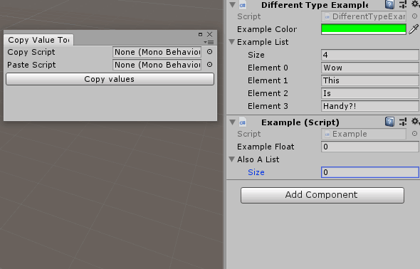

# System.Reflection.Simple
Classes and components that simplify reading and writing to fields by name easily.
Useful for exposing variables, copying large amounts of data from deprecated components and editor extensions.

Comes with the ValueCopyTool.cs example.

